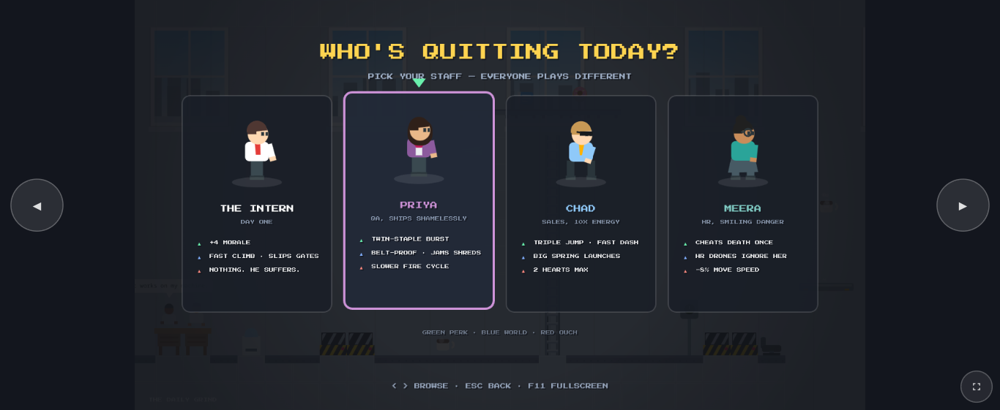
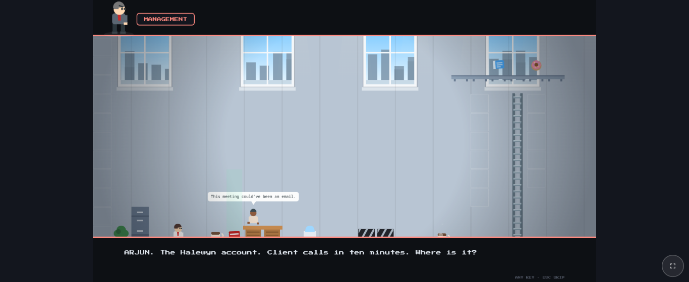
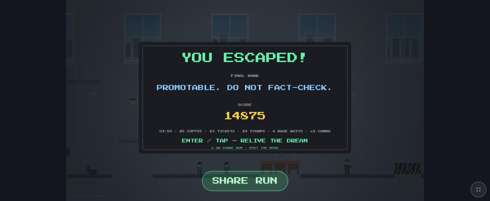

# THE DAILY GRIND

A corporate-office escape platformer that runs in any browser tab. No install, no build, no libraries — every sprite, song, and sound effect is generated by code at runtime. It's Monday, 8:59 AM. You've had enough. Quit gloriously.

<p align="center">
  
  
  
</p>

## Play it

**Online:** [daily-grind-s5j.pages.dev](https://daily-grind-s5j.pages.dev) — nothing to install.

**Desktop, offline:** clone or download this repo and open `index.html` in any modern browser.

```bash
git clone https://github.com/udit-001/daily-grind.git
```

**Phone:** open the link above. Touch controls appear on their own, and the game asks you to rotate to landscape.

## What a run looks like

- **Punch in** — pick your staff, meet your new employee in a punch-in intro, and sit through a short dialogue with MANAGEMENT (typewriter text; any key advances, Esc skips).
- **Escape four floors** — ONBOARDING, THE SPRINT, THE REORG, then EXIT INTERVIEW, where THE CEO takes your resignation personally. His leaps and stapler volleys telegraph (`LEAP INCOMING!` / `VOLLEY INCOMING!`); staples and stomps only land while he's dizzy. Outside those windows his suit goes `CLANK!`.
- **Fight the building** — stomp managers Mario-style, staple paper planes back at their senders, dodge shredders and HR drones, ride conveyors, climb the shelving.
- **Chug coffee** for a speed burst and points. **Collect TPS reports** for bigger points.
- **Punch the time clock** at checkpoints to save progress and restore morale.
- **Get ranked** — every run ends somewhere between UNPAID INTERN (PAID IN EXPOSURE) and 10X ENGINEER (ALLEGEDLY).
- **Share the obituary** — press `S` (or tap SHARE RUN) and the game copies a resignation-letter card, win or termination, with a challenge link baked in.

## Staff kits

| | Perk | World | Ouch |
| --- | --- | --- | --- |
| 🆓 **The Intern** | 4 morale | climbs 35% faster · **tailgates through closed security gates** | managers barely notice him |
| 🟣 **Priya · QA** | twin-staple burst | belts can't move her · **staples jam shredders** (2.5s, P1 fix) | 25% slower fire cycle |
| 😎 **Chad · Sales** | triple jump + fast dash | springs launch 22% higher | 2 morale max |
| 👔 **Meera · HR** | survives her first KO | HR drones ignore her (stompable) | −8% speed |

## Controls

| Input | Action |
| --- | --- |
| ← → / A D | Move |
| Space / W / ↑ / Z | Jump (press again mid-air to double-jump) |
| ↑ / W (hold) | Climb ladder · ↓ / S to climb down |
| Shift / X / C | Dash |
| F / 📎 button | Fire the trusty red stapler |
| ↓ / S (+jump) | Drop through one-way shelves |
| P / Esc | Pause (coffee break) |
| ⏸ pill | Pause (touch · top of screen) |
| Q | Quit to title (while paused) |
| M | Mute |
| R | Restart current day |
| Enter | Confirm / start |
| S | Share run (end screens) |
| F11 / ⛶ | Fullscreen (desktop) |

## The challenge loop

Every share card ends with a link like `https://daily-grind-s5j.pages.dev/#c=14875~PRIYA`. Open someone's link and their score greets you on the title screen (`⚠ CHALLENGE: PRIYA POSTED 14875`), rides along as a live TARGET in your HUD, and announces `CHALLENGE LEAD!` the moment you pass it. Your share then carries your score, and the chain continues.

Your staff pick and name sign every card; the office record and its holder are stamped on the title screen.

## Where your data goes

Nowhere. Scores, name, avatar, and hint progress live in your browser's localStorage. Nothing uploads; sharing a run is you pasting your own card.

## Under the hood

Canvas2D rendering, WebAudio chiptune and SFX, programmatic tile maps. No framework, no assets folder.

- `index.html` — shell + touch controls
- `js/game.js` — physics, entities, boss AI, renderer
- `js/levels.js` — level data
- `js/audio.js` — synthesized sound + music sequencer
- `debug/` — self-running test harnesses for specific mechanics
